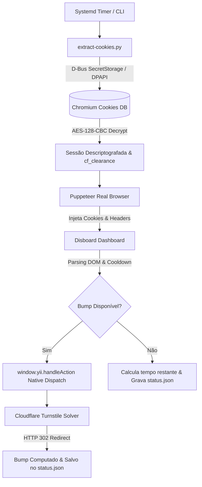

# 🚀 Disboard Auto-Bumper

<p align="center">
  
  
  
  
  
</p>

Robô inteligente e 100% autônomo para dar **Bump automático** em servidores Discord no site do **[Disboard](https://disboard.org)**. 

Resolve automaticamente os desafios do **Cloudflare Turnstile**, extrai sua sessão logada de forma segura do seu navegador e integra diretamente com o framework oficial do Disboard para nunca dar erro **405**.

---

## 📖 Índice

- [🟢 Guia para Iniciantes (Passo a Passo Rápido)](#-guia-para-iniciantes-passo-a-passo-rápido)
  - [1. Pré-requisitos](#1-pré-requisitos)
  - [2. Instalação e Configuração](#2-instalação-e-configuração)
  - [3. Testar o Bump](#3-testar-o-bump)
  - [4. Ver o Tempo Restante ao Vivo](#4-ver-o-tempo-restante-ao-vivo)
  - [5. Deixar Rodando 24/7 no Computador](#5-deixar-rodando-247-no-computador)
- [🛠️ Guia para Desenvolvedores (Arquitetura Técnica)](#️-guia-para-desenvolvedores-arquitetura-técnica)
  - [Visão Geral da Arquitetura](#visão-geral-da-arquitetura)
  - [1. Descriptografia de Sessão Linux Chromium](#1-descriptografia-de-sessão-linux-chromium)
  - [2. Bypass de Cloudflare Turnstile & WAF](#2-bypass-de-cloudflare-turnstile--waf)
  - [3. Eliminação do Erro 405 (Yii2 Native Dispatch)](#3-eliminação-do-erro-405-yii2-native-dispatch)
  - [4. Agendamento com Systemd Timer](#4-agendamento-com-systemd-timer)
- [📁 Estrutura do Repositório](#-estrutura-do-repositório)
- [⚖️ Licença](#-licença)

---

# 🟢 Guia para Iniciantes (Passo a Passo Rápido)

> **Você só quer que o robô faça os bumps sozinho sem complicação?** Siga estes passos simples:

### 1. Pré-requisitos
Certifique-se de ter instalado no seu Linux:
* **Node.js** (versão 18 ou superior)
* **Python 3**
* **Navegador** (Brave, Google Chrome ou Chromium) já logado na sua conta do Disboard.

Instale as dependências do sistema com um único comando no terminal:
```bash
# Ubuntu / Debian / Mint:
sudo apt update && sudo apt install -y nodejs npm python3 python3-pip python3-cryptography python3-secretstorage

# Arch Linux / Manjaro:
sudo pacman -S nodejs npm python python-cryptography python-secretstorage
```

---

### 2. Instalação e Configuração

1. **Clone o repositório:**
   ```bash
   git clone https://github.com/DouglasScarello/disboard-bumper.git
   cd disboard-bumper
   ```

2. **Instale as dependências do projeto:**
   ```bash
   npm install
   ```

3. **Crie seu arquivo de configuração:**
   ```bash
   cp config.example.json config.json
   ```

4. **Edite o `config.json` e coloque o nome do(s) seu(s) servidor(es):**
   ```json
   {
     "serverWhitelist": [
       "Nome do Seu Servidor 1",
       "Nome do Seu Servidor 2"
     ],
     "clickDelayMin": 2000,
     "clickDelayMax": 5000,
     "retryAttempts": 3,
     "retryDelayMinutes": 3
   }
   ```
   > 💡 *Dica:* Se deixar a lista vazia `[]`, o robô dará bump em todos os servidores disponíveis na sua conta.

---

### 3. Testar o Bump
Execute o script manualmente para ver o robô funcionando na hora:
```bash
node bump.js
```
O robô abrirá a conexão, lerá sua sessão logada, verificará os cronômetros e dará o bump nos servidores liberados!

---

### 4. Ver o Tempo Restante ao Vivo
Para ver a contagem regressiva em tempo real dos seus servidores:
```bash
node status.js
```
Exemplo de saída:
```text
═══════════════════════════════════════════════════════════
         🤖 DISBOARD AUTO-BUMPER — LIVE STATUS            
═══════════════════════════════════════════════════════════
📡 Última verificação no Disboard: 22:22:03 (há 3m atrás)
───────────────────────────────────────────────────────────

📌 Servidor: Meu Servidor Discord
   Status: ⏱️  00:35:12 restantes

───────────────────────────────────────────────────────────
🔄 Background timer roda a cada 20 minutos automaticamente.
═══════════════════════════════════════════════════════════
```

---

### 5. Deixar Rodando 24/7 no Computador
Para o robô rodar sozinho em segundo plano mesmo se você fechar o terminal:

1. Copie os arquivos de serviço do systemd:
   ```bash
   mkdir -p ~/.config/systemd/user
   cp systemd/disboard-bumper.service ~/.config/systemd/user/
   cp systemd/disboard-bumper.timer ~/.config/systemd/user/
   ```

2. Ajuste o caminho do seu projeto no arquivo `~/.config/systemd/user/disboard-bumper.service`:
   Substitua `/path/to/disboard-bumper` pelo caminho real da sua pasta (ex: `/home/seu-usuario/disboard-bumper`).

3. Ative e inicie o timer do sistema:
   ```bash
   systemctl --user daemon-reload
   systemctl --user enable --now disboard-bumper.timer
   ```
Pronto! O Linux agora executará a checagem automaticamente a cada 20 minutos, sem você precisar fazer nada! 🎉

---

# 🛠️ Guia para Desenvolvedores (Arquitetura Técnica)

Esta seção detalha a engenharia por trás do projeto e como superamos os desafios de autenticação, WAF e anti-automação do Disboard.



### 1. Descriptografia de Sessão Linux Chromium (`extract-cookies.py`)
Em sistemas Linux, o Chromium (Google Chrome, Brave, Chromium) armazena os cookies no banco SQLite `~/.config/.../Default/Cookies` com a coluna `encrypted_value`.
- A chave de criptografia é obtida via protocolo D-Bus com o **SecretService** (GNOME Keyring / KWallet).
- O algoritmo utiliza derivação de chave **PBKDF2 HMAC-SHA1** (1 iteração, salt `saltysalt`, tamanho 16 bytes) e cifra **AES-128-CBC** com IV de 16 espaços (`b' ' * 16`).
- As versões modernas do Chromium incluem uma assinatura/cabeçalho de 32 bytes no payload descriptografado que é tratado e removido automaticamente antes da injeção.

### 2. Bypass de Cloudflare Turnstile & WAF
O endpoint de bump do Disboard (`/server/bump/<id>`) é protegido pelo **Cloudflare Managed Challenge (Turnstile)**.
- Navegadores headless padrão (Puppeteer/Playwright) são bloqueados com `HTTP 403` devido a assinaturas TLS, WebGL e a flag `navigator.webdriver`.
- Utilizamos o **`puppeteer-real-browser`**, que injeta patches de fingerprint em nível de protocolo e simula interações humanas (atrasos aleatórios entre 2000ms e 5000ms), resolvendo o widget Turnstile automaticamente.

### 3. Eliminação do Erro 405 (Yii2 Native Dispatch)
O Disboard é construído sobre o framework PHP **Yii2**.
- O botão de bump (`<a class="button-bump" data-method="post">`) intercepta o clique do mouse e gera dinamicamente um `<form method="POST">` contendo o token CSRF (`_csrf`).
- Fazer requisições `GET` diretas na URL de bump ou simular formulários sem o contexto CSRF correto faz o backend rejeitar com **`405 Method Not Allowed`**.
- O `bump.js` executa o disparo nativo chamando diretamente:
  ```javascript
  window.yii.handleAction(window.jQuery(element));
  ```
  Isso garante que todos os cabeçalhos, tokens CSRF e redirecionamentos pós-POST sejam processados de acordo com o protocolo oficial do site.

### 4. Agendamento com Systemd Timer
- Em vez de loops infinitos na memória que consomem RAM e CPU, o sistema opera sob o modelo **`oneshot`**.
- O `disboard-bumper.timer` dispara a cada 20 minutos, acorda o serviço, analisa os servidores e encerra o processo.
- Com `Persistent=true`, se a máquina for suspensa ou desligada durante a janela de bump, a execução ocorre imediatamente após o despertar do sistema.

---

## 📁 Estrutura do Repositório

```text
disboard-bumper/
├── bump.js                   # Motor principal de bump e análise de cooldown
├── status.js                 # CLI interativa para status em tempo real
├── extract-cookies.py        # Módulo Python de descriptografia de cookies
├── config.example.json       # Template de configuração de servidores
├── package.json              # Metadados e dependências Node.js
├── systemd/                  # Modelos de serviço e timer para Linux
│   ├── disboard-bumper.service
│   └── disboard-bumper.timer
├── LICENSE                   # Licença MIT
└── README.md                 # Documentação completa
```

---

## ⚖️ Licença

Distribuído sob a licença **MIT**. Consulte o arquivo [LICENSE](LICENSE) para mais detalhes.

> ⚠️ **Aviso:** Este projeto foi desenvolvido para fins educacionais e de automação pessoal de produtividade. Respeite os termos de serviço das plataformas utilizadas.
